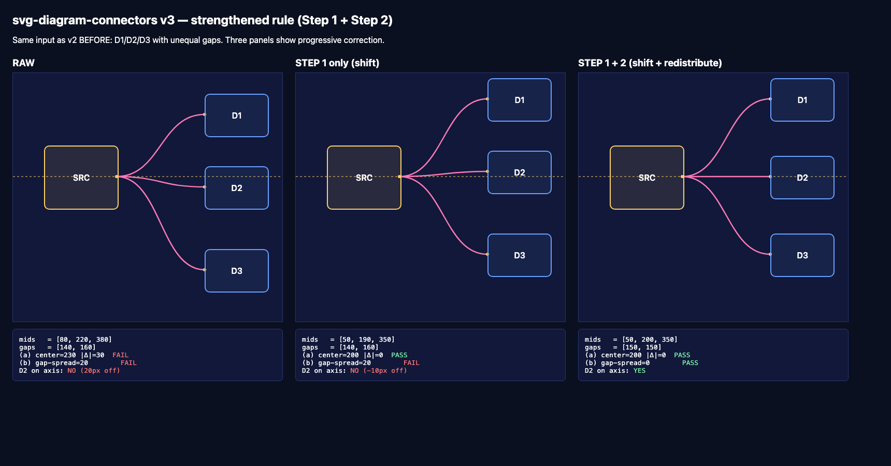

# Worked Example — Smoke Test

End-to-end application of the skill against the diagram in [`../smoke-test/index.html`](../smoke-test/index.html).
Three panels show the same input progressing through Step 1 (shift) and Step 2
(redistribute) of the fan-out vertical centering rule.



## Input

A source box `SRC` fanning out to three destinations `D1`, `D2`, `D3` deliberately
placed with **unequal vertical gaps**:

| Box | left | top | width | height | left/right-wall mid Y |
|---|---|---|---|---|---|
| SRC | 60  | 140 | 140 | 120 | **200** (right-wall mid) |
| D1  | 370 | 40  | 120 | 80  | 80  (left-wall mid) |
| D2  | 370 | 180 | 120 | 80  | 220 (left-wall mid) |
| D3  | 370 | 340 | 120 | 80  | 380 (left-wall mid) |

Source right-wall midpoint = `(60+140, 140+120/2) = (200, 200)`.
Destination midpoint Ys = `[80, 220, 380]`. Gaps = `[140, 160]` — unequal.

## Panel 1 — RAW

Draw three bezier paths directly from `SRC` right-wall mid `(200, 200)` to each
destination's left-wall mid using the standard template
`Cx = Ax + (Bx - Ax) / 2 = 285`:

```svg
<path d="M 200 200 C 285 200 285  80 370  80" />
<path d="M 200 200 C 285 200 285 220 370 220" />
<path d="M 200 200 C 285 200 285 380 370 380" />
```

Run the assertions:

```
mids   = [80, 220, 380]
gaps   = [140, 160]
(a) center = (80 + 380) / 2 = 230   |Δ from src 200| = 30   FAIL
(b) gap-spread = 160 - 140 = 20                              FAIL
D2 on axis: NO (-20px off)
```

Both assertions fail. Apply the rule.

## Panel 2 — Step 1 only (shift)

Center the bounding box on the source midpoint:

```
total_span     = (340 + 80) - 40 = 380
first_dest_top = 200 - 380/2 = 10
Δ              = 10 - 40 = -30          # shift all dest tops by -30
```

After shift:

| Box | new top | left/right-wall mid Y |
|---|---|---|
| D1 | 10  | 50  |
| D2 | 150 | 190 |
| D3 | 310 | 350 |

Re-run assertions:

```
mids   = [50, 190, 350]
gaps   = [140, 160]                   # unchanged — Step 1 doesn't touch gaps
(a) center = (50 + 350) / 2 = 200    |Δ| = 0     PASS
(b) gap-spread = 20                              FAIL
D2 on axis: NO (-10px off)
```

(a) passes — outer envelope is now symmetric — but (b) still fails. D2 is at
y=190, ten pixels above the axis. The original 20px gap inequality has been
preserved by a uniform shift. Apply Step 2.

## Panel 3 — Step 1 + Step 2 (redistribute)

Redistribute so destination midpoints are evenly spaced:

```
first_top = 10
first_mid = 10 + 80/2  = 50
last_mid  = 10 + 380 - 80/2 = 350
mid_step  = (350 - 50) / (3 - 1) = 150

D1.top = 50  + 0*150 - 80/2 = 10
D2.top = 50  + 1*150 - 80/2 = 120 + 40 = 160     # was 150, shift down 10
D3.top = 50  + 2*150 - 80/2 = 310                # unchanged
```

After redistribute:

| Box | top | left/right-wall mid Y |
|---|---|---|
| D1 | 10  | 50  |
| D2 | 160 | 200 |
| D3 | 310 | 350 |

Re-run assertions:

```
mids   = [50, 200, 350]
gaps   = [150, 150]
(a) center = 200   |Δ| = 0   PASS
(b) gap-spread = 0           PASS
D2 on axis: YES
```

Both assertions pass. D2's midpoint sits exactly on `y=200`, the source axis.

## Final paths

```svg
<!-- Source mid: (200, 200) -->
<path d="M 200 200 C 285 200 285  50 370  50" />  <!-- → D1 -->
<path d="M 200 200 C 285 200 285 200 370 200" />  <!-- → D2 (straight) -->
<path d="M 200 200 C 285 200 285 350 370 350" />  <!-- → D3 -->
```

Note the middle path collapses to a horizontal line — the cubic bezier degenerates
to a straight segment when source Y equals destination Y. That's the visual
signature of a correctly-centered fan-out.

## Reproducing this output

```bash
git clone https://github.com/sliuuu/svg-diagram-connectors.git
cd svg-diagram-connectors
open smoke-test/index.html        # interactive
# or:
npm install && npm test           # headless assertion runner
```

The `npm test` script runs [`smoke-test/run.js`](../smoke-test/run.js) which loads
`index.html` in headless Chromium, reads the three report panels, and asserts:

- The RAW panel contains `FAIL` (test exercises the failure case)
- The STEP 1 panel contains `FAIL` on (b) (proves Step 1 alone is insufficient)
- The STEP 1+2 panel contains only `PASS` (proves the strengthened rule fixes it)

Exit code 0 = all assertions hold. CI runs the same script on every push to any
branch — see [`.github/workflows/smoke-test.yml`](../.github/workflows/smoke-test.yml).
